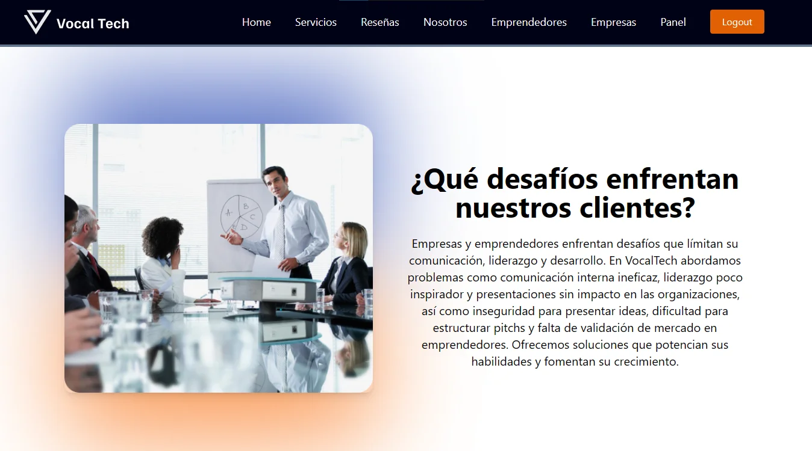

## h4-02-vocaltech

# 
VocalTech

Alianza estratégica entre "No Country" y "Vos y Tu Voz", donde las fuerzas se unen para crear un espacio de comunicación y tecnología al servicio de emprendedores y empresas.
## 

##  Misión 
Apoyar a emprendedores y empresas en su camino al éxito, enfocándonos en los pilares fundamentales: comunicación y tecnología. A través de un enfoque estratégico y personalizado, realizamos diagnósticos que nos permiten identificar necesidades específicas y brindar soluciones efectivas que impulsen su crecimiento.

##  Visión 
Creemos en el poder del conocimiento y la colaboración para construir un futuro innovador y dinámico. Queremos empoderar a todos nuestros leads, difundiendo oportunidades y fortaleciendo el poder de la voz para impactar positivamente en la comunidad global.

## 🖥 Tech Stack 

 * **Project type:** `Tecnología y comunicación`
 * **QA Tester:** `Notion` `Google Drive`.
 * **Backend:** `Node` `Express` `AirTable` `Docker`.
 * **Frontend:** `HTML` `CSS` `JS` `React` `Vite` `Axios` `Tailwind` `MUI`.
 * **Design:** `Figma for prototypes and wireframes`.

## 📌 Team:

| Count | Name |    linkedin.com/in/ | image| Github   Nickname| Role   |
| --- |--- | --- | --- | --- | ---: |
| 1  | Lucas Matias Segovia | [**lumseg/**](https://www.linkedin.com/in/lumseg/) |  | [**LumDev86**](https://github.com/LumDev86) | Backend   |
| 2  | Leon Asturizaga | [**leon-asturizaga-94a80377/**](https://www.linkedin.com/in/leon-asturizaga-94a80377) | | [**leonasturizaga**](https://github.com/leonasturizaga) | Backend   |
| 3  | Rocio Carle | [**rociocarle/**](https://www.linkedin.com/in/rociocarle/) |  | [**Rocksyro**](https://github.com/Rocksyro) | Frontend   |
| 4  | Alicia Gálvez Rodríguez | [**alicia-galvez-rodriguez/**](https://www.linkedin.com/in/alicia-galvez-rodriguez/) |  | [**alicia4079**](https://github.com/alicia4079) | Frontend   |
| 5  | Nataly Prado | [**natalypradomoreno/**](https://www.linkedin.com/in/natalypradomoreno/) |  | [**natalypradomoreno**](https://github.com/natalypradomoreno) | PM   |
| 6  | Juan Passadore| [**juan-pablo-passadore-denis-105349116/**](https://www.linkedin.com/in/juan-pablo-passadore-denis-105349116/)|  | [**juampypassa**](https://github.com/juampypassa) | Tester-QA   |
| 7  | Lucero Rey| [**lucero-rey**](https://www.linkedin.com/in/lucero-rey)|  | [**LuluzRey**](https://github.com/LuluzRey) | UX-UI   |

## 🎥 Promotional Video

[**VocalTech Video**](https://drive.google.com/file/d/1zoXMSyAm-Ny8wIgYLUqHCWL2qCplmiaZ/view)

## 💻 UX-UI Documentation
[**VocalTech Figma design**](https://www.figma.com/design/LExpmOB6yNJYFO7kgCD1x2/Vocaltech?node-id=1-2&p=f&t=ALcJN60GCs60qR9O-0)

## 💻 QA Documentation
[**VocalTech User Stories**](https://docs.google.com/document/d/1jxtkchETVfUYGUclbFcKtSKXUcXTNjwQLEWaDDmANnM/edit?usp=drive_link)

[**VocalTech Acceptance Criteria**](https://docs.google.com/document/d/1wZrrlwxsTaVbkSp-XTaMBemwnlIP-_-R65wyqlZahLY/edit?usp=drive_link)

📂[**VocalTech Google drive**](https://drive.google.com/drive/folders/1FbyCk9MqTLDwHoYWK5MgNJERJB-vPSKt?usp=drive_link)

## 💻 Thanks

[**No Country**](https://www.nocountry.tech/)

  

